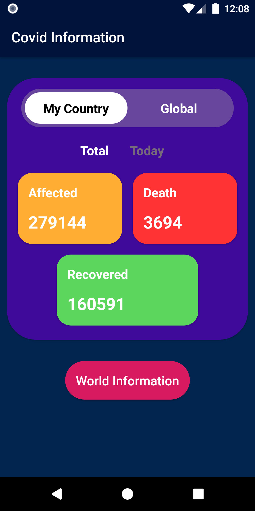
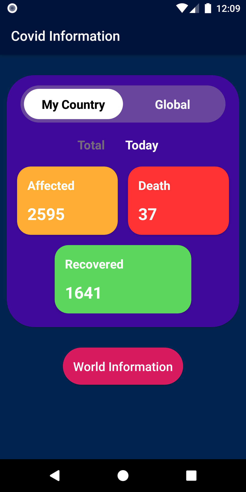
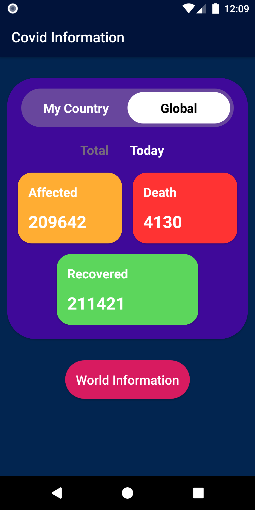
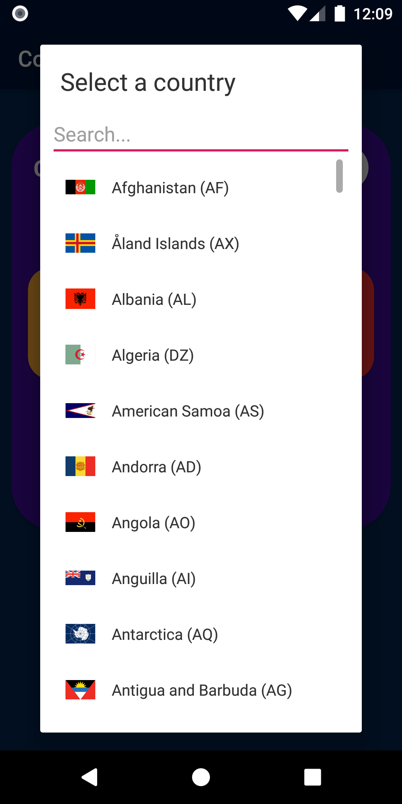
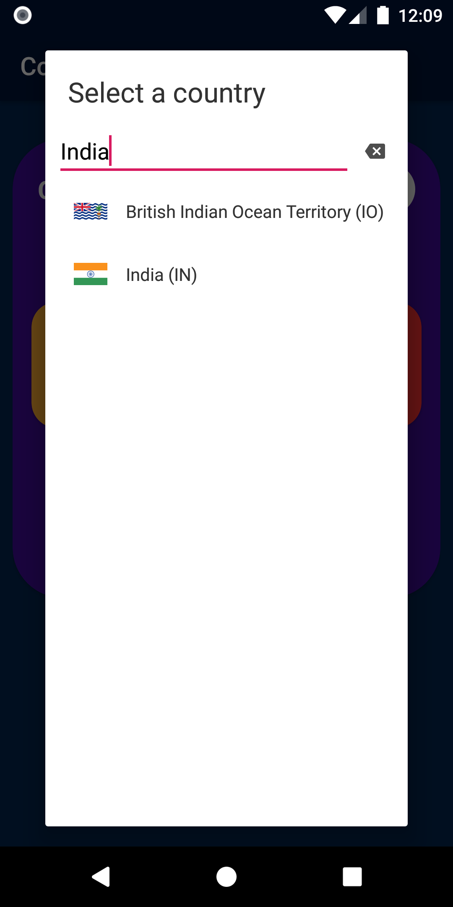
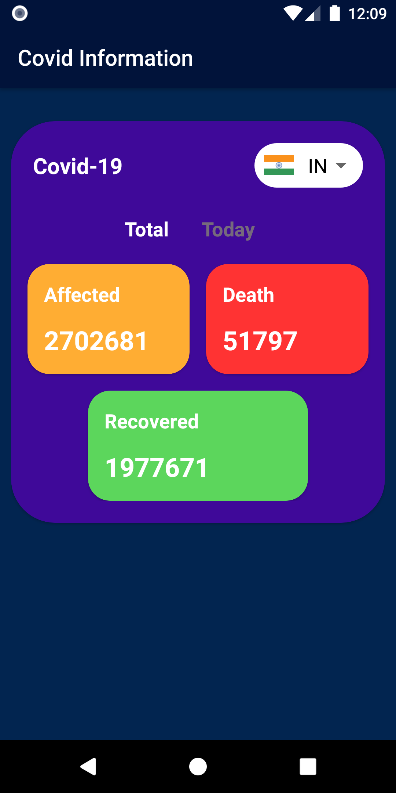
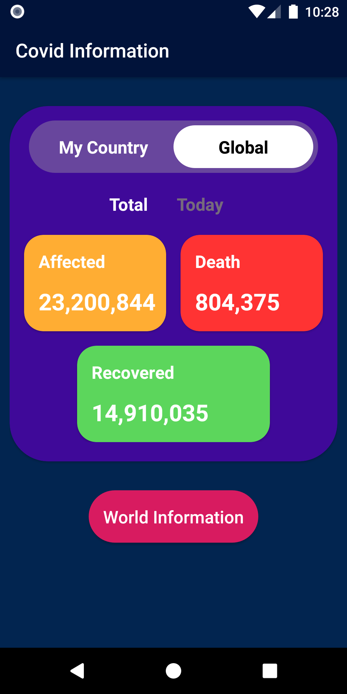
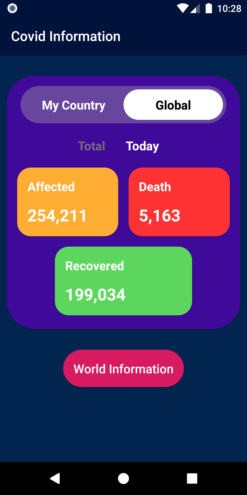

# CovidInformation
This is an android apps. I learned how to retrieve data from server using RESTfull api. This apps is the implementation of what I learned.

# Features
- Affected, Death and Recovered information are available
- Bangladesh's COVID information update
- Global COVID information update
- All countries all over the world COVID information
- Search information by Country Name Code

# Use Tools
- <a href="https://developer.android.com/studio?hl=es">Android Studio (XML+Java)</a>
- <a href="https://developer.android.com/jetpack/androidx/releases/cardview">Card View</a>
- <a href="https://github.com/hbb20/CountryCodePickerProject">Country Code Picker Library</a>
- <a href="square.github.io/retrofit/">Retrofit</a>
- <a href="https://documenter.getpostman.com/view/10808728/SzS8rjbc?version=latest">POSTMAN API</a>

# Screen Shots

## Old Version
   

   

   

   

   

## New Version

   

   

# Download Link

- Link: https://drive.google.com/file/d/1ny0SeMRT2PLzGWjsvg6ma2MqX34N2Iqc/view?usp=sharing
